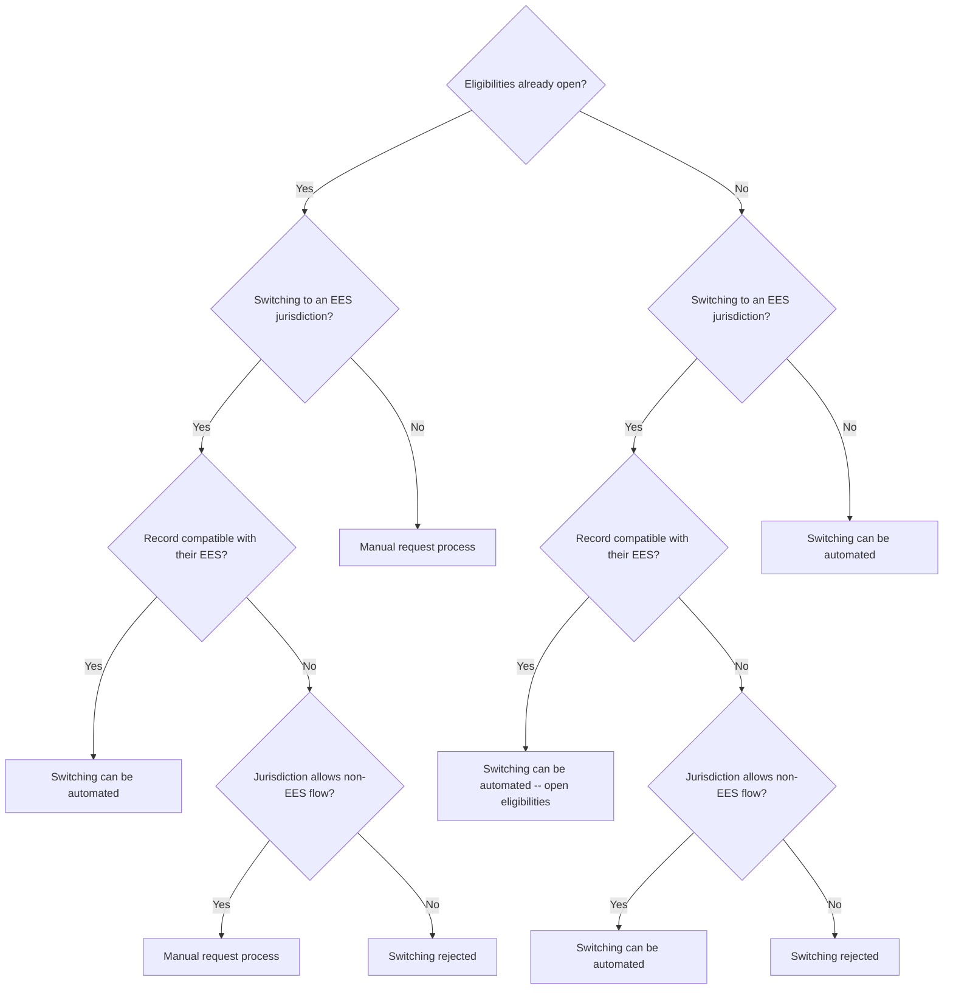

# Core Diagrams

## Self Serve Jurisdiction Switching 

### Logical State Diagram


### API FLow
```mermaid
sequenceDiagram
    participant Apps_UI as Apps UI
    participant Jurisdiction_Switching_API as Jurisdiction Switching API
    participant History_Logging as History Logging
    participant Email_Handler as Email Handler
    participant Zendesk_Handler as Zendesk Handler
    participant IJurisdictionSwitchRequested_Handler as IJurisdictionSwitchRequested Handler

    Apps_UI->>Jurisdiction_Switching_API: Calls Jurisdiction Switching API
    Jurisdiction_Switching_API->>Jurisdiction_Switching_API: Checks CanSwitch flag
    alt CanSwitch is true
        Jurisdiction_Switching_API->>IJurisdictionSwitchRequested_Handler: Publish JurisdictionSwitchRequested event
        IJurisdictionSwitchRequested_Handler->>IJurisdictionSwitchRequested_Handler: Switches user to new Jurisdiction
        IJurisdictionSwitchRequested_Handler->>Email_Handler: Sends event to Email Handler
    else CanSwitch is false
        Jurisdiction_Switching_API->>Zendesk_Handler: Publish event to Zendesk Handler
    end
    Jurisdiction_Switching_API->>History_Logging: Log jurisdiction switch or attempt
